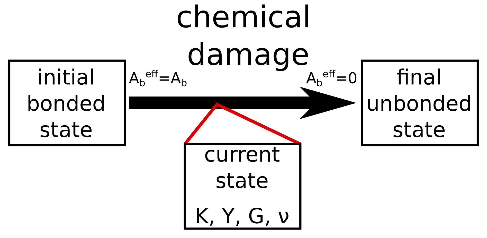
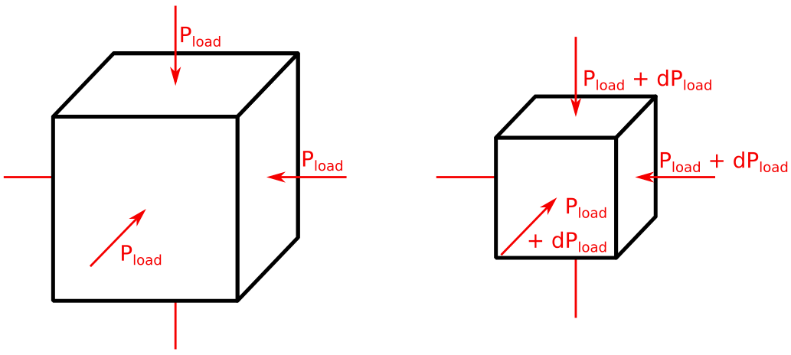
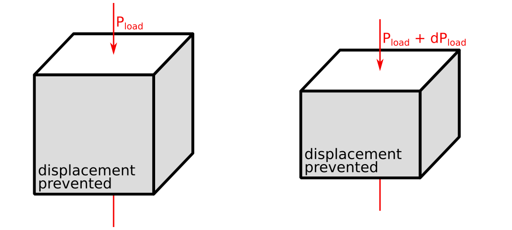

# Rock_Properties_MassRemoval
Determine elastic properties (Young modulus, bulk modulus, shear modulus, and Poisson ratio) of rocks with debonding. It uses a Fast Fourier Transform formulation.
A Phase-Field description is applied to determine the evolution of the microstructure due to the chemical damage.

To do so, incremental perturbations are employed considering isotropic and oedometric loading conditions.

The same framework is employed, considering a Discrete Element Model [here](https://github.com/AlexSacMorane/Rock_Properties_MassRemoval_DEM).

### Isotropic loading

The bulk modulus can be determined, considering: dP_load = K x depsilon_volumetric.

### Oedometric loading

The oedometric Young modulus can be determined, considering: dP_load = Yoedo x depsilon_z.
The Young modulus can be determined, considering: Y = Yoedo*(1+v)(1-2v)/(1-v)  
The Poisson ratio can be determined, considering: v = k0/(1+k0).

## Technical description

A [documentation](https://alexsacmorane.github.io/pf/rock_props_debonding/) for the python script is available.

